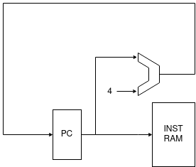
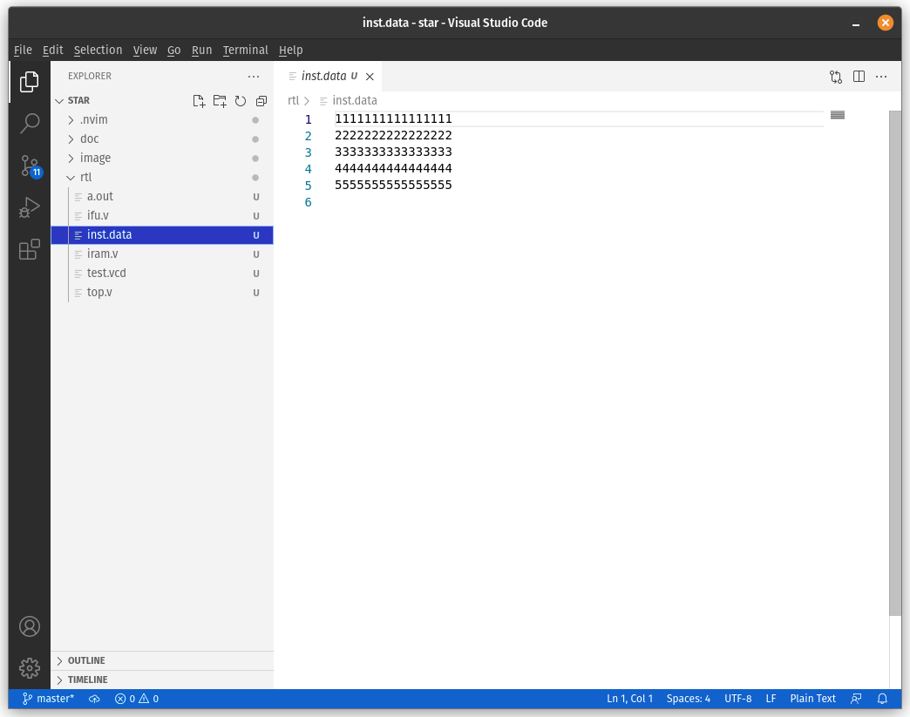
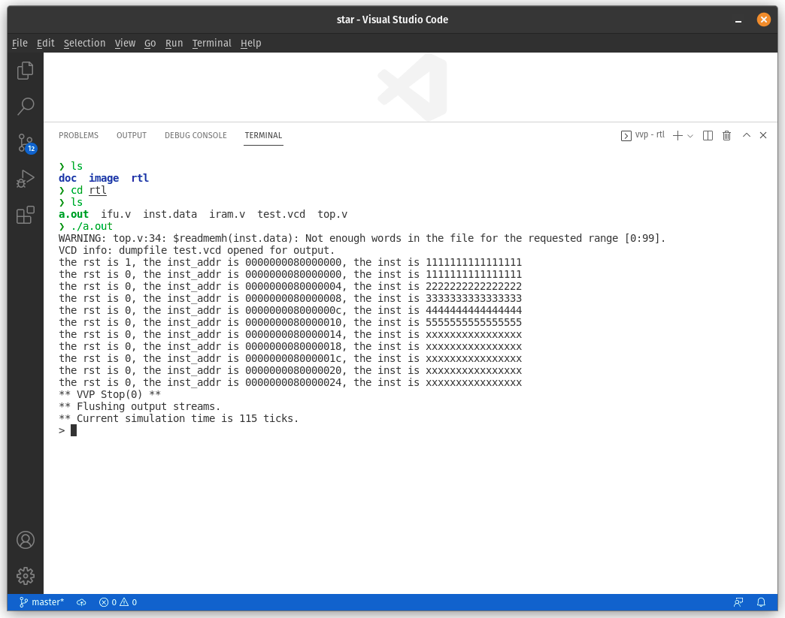
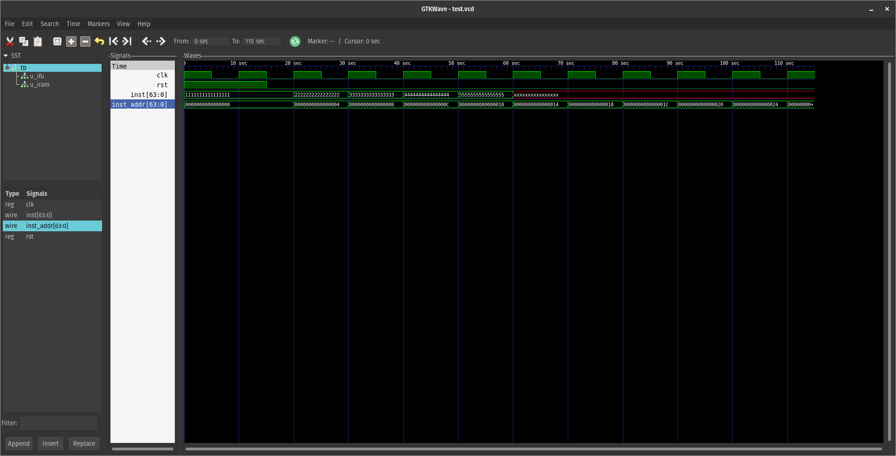
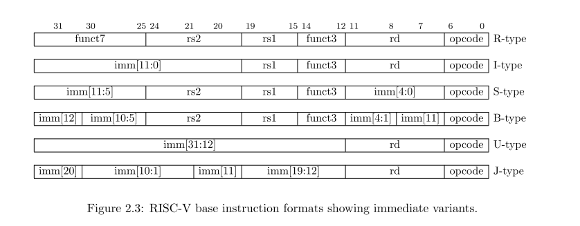

# CPU 实现
从头开始实现一个RISCV64的流水线项目

## IFU阶段的实现
1. IFU阶段主要实现的为PC寄存器，通过PC的更新能够得到相应指令的地址，并通过接入指令存储器获得相应的指令。    

 

由此我们可以实现相应的 verilog 代码
```verilog 
reg [63:0] pc;
wire [63:0] next_pc;
assign next_pc = pc + 4;
always @(posedge clk) begin 
  if(rst) begin 
    pc <= 64'h0;
  end
  else begin 
    pc <= next_pc;
  end
end
```

现在我们可以进行一个简单测试：我们手动实现一个异步RAM，并通过模拟进行测试。

> 异步RAM的含义是读写不与时钟同步，即一旦信号发出就直接获得（写入）数据，同步RAM这需要在始终上升沿才进行读出（写入）。

现在我们的ifu完整模块与 iram 模块完整内容如下
```verilog 
// IFU
module IFU(
  input clk,
  input rst,
  output inst_addr
);

reg [63:0] pc;
wire [63:0] next_pc;
assign next_pc = pc + 4;
always @(posedge clk) begin 
  if(rst) begin 
    pc <= 64'h0;
  end
  else begin 
    pc <= next_pc;
  end
end
endmodule

// iram
module IRAM(
  input [63:0] inst_addr,
  output reg [63:0] inst
);
// 模拟一个位宽64bit, 块数100的 ram 大小
reg [63:0] mem[99:0];

// 这里我们只使用位宽的一部分，因为前面用不到，而我们使用字寻址，ram 则是以字节寻址，因此不需要后两位（字节偏移）
always @(*) begin 
  inst = mem[inst_addr[5:2]];
end
endmodule
```

为了进行测试，我们还需要使用一个顶端模块作为testbench，对应的文件如下。
```verilog 
module tb();
reg clk, rst;
wire [63:0] inst_addr;
wire [63:0] inst;

// 实例化ifu模块
IFU u_ifu(
  .clk(clk),
  .rst(rst),
  .inst_addr(inst_addr)
);

// 实例化iram模块
IRAM u_iram(
  .inst_addr(inst_addr),
  .inst(inst)
);

//模拟复位，当我们的时间单元到100时，测试停止
initial begin 
  rst = 1;
  #15 rst = 0;
  #100 
  $stop;
end

//时钟周期为10个时钟单元，使用display函数能够直接从输出中观察结果
initial begin 
  clk = 1; #5 clk = 0;
  forever begin
    $display("the rst is %b, the inst_addr is %x, the inst is %x", rst, inst_addr, inst);
    #5 clk = 1; #5 clk = 0;
  end
end

// 将文件中内容读取到 iram 中
initial begin 
  $readmemh("inst.data", tb.u_iram.mem);
end

// 生成波形，你也可以通过查看波形观察结果是否正确
initial begin
    $dumpfile("test.vcd");
    $dumpvars(0, tb);
end

endmodule
```

对应的`inst.data`文件内容如下



测试结果如下



生成波形如下

 

> 我们只存储了5组数据，因此对之后地址的访问会是x（未定值）

> 这里写完之后才发现有个问题，指令应该是32位的，但内容懒得改了，思想一样。

## IDU阶段的实现
获取指令后，我们可以对指令进行处理，决定之后处理器的行为，这个阶段被称为译码。    

在开始译码前，我们首先要完成另外两个部分：寄存器堆和立即数扩展。

### 寄存器堆
RISCV 基础指令集中提供了32个通用寄存器，绝大部分指令的操作数来自于寄存器中，因此我们需要实现一个寄存器堆。寄存器堆提供了两个读接口和一个写接口，这是因为我们的部分指令的两个操作数都来自于寄存器，因此需要一次提供两个端口的读写。

```verilog
module REG(
  input clk,
  input rst,
  input [63:0] read_addr1,
  input [63:0] read_addr2,
  input we,
  input [63:0] write_addr,
  input [63:0] write_data,
  output [63:0] read_data1,
  output [63:0] read_data2
);

reg [63:0] rf[31:0];
always @(posedge clk) begin 
  if(rst) begin 
    rf[32'h0] <= 64'b0;
    rf[32'h1] <= 64'b0;
    rf[32'h2] <= 64'b0;
    rf[32'h3] <= 64'b0;
    rf[32'h4] <= 64'b0;
    rf[32'h5] <= 64'b0;
    rf[32'h6] <= 64'b0;
    rf[32'h7] <= 64'b0;
    rf[32'h8] <= 64'b0;
    rf[32'h9] <= 64'b0;
    rf[32'ha] <= 64'b0;
    rf[32'hb] <= 64'b0;
    rf[32'hc] <= 64'b0;
    rf[32'hd] <= 64'b0;
    rf[32'he] <= 64'b0;
    rf[32'hf] <= 64'b0;
    rf[32'h10] <= 64'b0;
    rf[32'h11] <= 64'b0;
    rf[32'h12] <= 64'b0;
    rf[32'h13] <= 64'b0;
    rf[32'h14] <= 64'b0;
    rf[32'h15] <= 64'b0;
    rf[32'h16] <= 64'b0;
    rf[32'h17] <= 64'b0;
    rf[32'h18] <= 64'b0;
    rf[32'h19] <= 64'b0;
    rf[32'h1a] <= 64'b0;
    rf[32'h1b] <= 64'b0;
    rf[32'h1c] <= 64'b0;
    rf[32'h1d] <= 64'b0;
    rf[32'h1e] <= 64'b0;
    rf[32'h1f] <= 64'b0;
  end
  else if (we) begin 
    if(write_addr != 32'b0) begin
      rf[write_addr] <= write_data;
    end
  end
end

assign read_data1 = read_addr1 == 32'b0 ? 64'b0 : (we && write_addr == read_addr1) ? write_data : rf[read_addr1];
assign read_data2 = read_addr2 == 32'b0 ? 64'b0 : (we && write_addr == read_addr2) ? write_data : rf[read_addr2];
endmodule
```

> RISCV要求0号寄存器恒为0

> 当写信号和读信号同时拉高时，我们想要读取写入的新值，但只有上升沿才会写入，这被叫做数据冒险，因此我们需要添加判断解决问题。

### 立即数扩展
相对于从寄存器堆中取得操作数，有些指令的操作数来自于该条指令本身中，这被叫做立即数，但我们的操作数为字长，从指令中（还是指令的部分片段）得到的数一定小于字长，因此需要进行立即数扩展。    

从下图我们可以看到不同指令类型立即数所在的位置。

 

> 立即数扩展都是符号扩展。

对于立即数扩展，我们可以看到J型和B型的最后一位是1，这是因为我们都是对齐跳转指令，正如我们上面在 iram 中的截断一样，后两位一定是0，但在 riscv 标准架构中，只有最后1位是0，这是因为 riscv 支持16位字长的压缩指令集。

现在我们可以开始我们的指令译码了

### 译码
通过上图的指令格式，我们也可以看出来不同类型的指令有一定的规整性，因此可以通过取出指令的funct7, funct3和opcode部分实现对指令的确定。    

让我们从一条 add 开始进行译码。   

 

当我们确定add指令后，我们可以开始决定cpu的行为：
1. 程序需要执行加法，因此我们将执行加法的控制信号传递给ALU(执行阶段)
2. 程序的两个操作数来源于寄存器堆，同时我们给寄存器堆提供了地址（来自rs1，rs2)，操作数也会同时送到ALU中
3. 程序需要写入寄存器堆，需要提供写入地址和写使能信号。

```verilog
module IDU(
  input [31:0] inst
);
wire [6:0] funct7;
wire [2:0] funct3;
wire [6:0] opcode;
wire rs1;
wire rs2;
wire rd;
assign funct7 = inst[31:25];
assign funct3 = inst[14:12];
assign rs1 = inst[19:15];
assign rs2 = inst[24:20];
assign rf = inst[11:7];
wire inst_add;

assign inst_add = funct7 == 7'b0000000 && funct3 == 3'b000 && opcode == 7'b0110011;
endmodule
```

添加了译码阶段的完整部件后（上图只是其中一个部分，还需要很多控制信号），你的数据通路看起来应该是这样。

## 执行
### ALU的设计
执行阶段最为重要的是ALU的设计，相对于加法器，ALU可以完成不同的操作，下面是一个简单的ALU示例。
```verilog
//注意这只是一个特别简单的ALU设计示例，没有提供溢出等判断操作，只是为了让你直观感受一下。
module ALU(
  input [63:0] src1,
  input [63:0] src2,
  input add_op,
  output [63:0] result
);
wire [63:0] add_result;
assign add_result = src1 + src2;
assign result = add_op ? add_result : 64'b0;
endmodule
```
