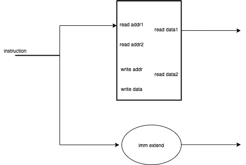

# 处理器结构
处理器结构由两个部分组成：控制器与数据通路。数据通路为CPU内部各个执行部件提供了传递信息的路径，而控制器则决定了数据通路中每一部分通路的建立，不同指令的数据通路不同，相应的控制逻辑也不同。  

## 数据通路
在正式开始设计CPU之前，我们可以先考虑数据通路的组成。CPU的数据通路有三个重要部分：寄存器堆、ALU和存储器。    

> 并不是所有指令都会通过全部的数据通路，比如数据存储器只有 load 和 store 指令才会进行访问。

### 从一条 load 指令开始
为了能够运用上数据存储器，我们的数据通路将以一条 load 指令开始，下面我们来分析 lw 指令的数据通路实现。

#### 取得数据
首先我们需要考虑如何从指令存储器中得到一条指令，因此我们需要PC（程序计数器），同时我们在取得该条指令后还需要让我们的PC增加到下一条指令的地址（对于RV32i，这里是+4）。因此我们可以获得下面的数据通路部分。

 

> 在单周期下，我们唯一的寄存器类型就是PC了，PC只有在每一次时钟边缘才会改变，又或者说如果PC是组合逻辑我们的处理器将无法正常工作，想想看这是为什么?

#### 从寄存器堆获取src（或从立即数获取）
下一步，我们将对指令进行拆分+分析（硬件处理），为了获取运算所需的操作数，我们需要访问寄存器堆，寄存器堆有两个读地址端口和两个读输出端口，因此我们可以一次访问两个寄存器并获取数据，但对于lw指令我们只需要一个，因为lw指令的另一个操作数来自于立即数：**这意味着我们还需要一个立即数扩展单元**将立即数扩展成32位作为第二个源操作数。至此我们可以完成第二部分的数据通路。

#### 运算
现在，我们从寄存器堆中获取了src1，又通过立即数扩展单元获得了src2，因为lw指令需要src1+src2来获得访存地址，因此我们可以通过ALU完成运算，并获取结果。

#### 访问数据存储器指令
我们通过访存地址连接到数据存储器上，数据存储器可以给到我们相应地址的数据，因为数据存储器的数据宽度是32位（4个byte），刚好是我们lw所需要的大小，因此不需要对数据进行处理。现在我们只剩下lw指令要求的一个指令没有完成：将获得数据写入回寄存器中。

现在我们可以将之前的部件组装一下了。

#### 得到的数据放在哪? 写回
riscv要求我们并不能直接对存储器内数据进行操作（精简指令集简化了硬件设计），我们需要将数据写入到寄存器中，因此我们还需要从指令中拆分出的写寄存器地址连接到寄存器堆的写地址端口上，同时我们也需要将获得的数据也连接到寄存器堆的写数据端口上。

### 更多细节
现在我们完成了一条lw指令的数据通路，但当我们真正实现lw指令时还要考虑一些问题，如开始所说，我们需要实现的有数据通路与控制逻辑两部分，在这里我们只完成了数据通路的实现，并没有实现控制逻辑，如果你完成了ALU的设计，你应该能完成控制逻辑的构建。

同时对于lw指令，我们使用了rdata1和立即数扩展两个数据源，目前来看是可以的，但如果我们有一条指令使用rdata1和rdata2作为数据源呢？由于ALU只能接受两个操作数，我们需要对数据通路进行选通处理，这里的选通方式是多路选择器。由于多路选择的存在，你现在又要添加更多控制逻辑了。
